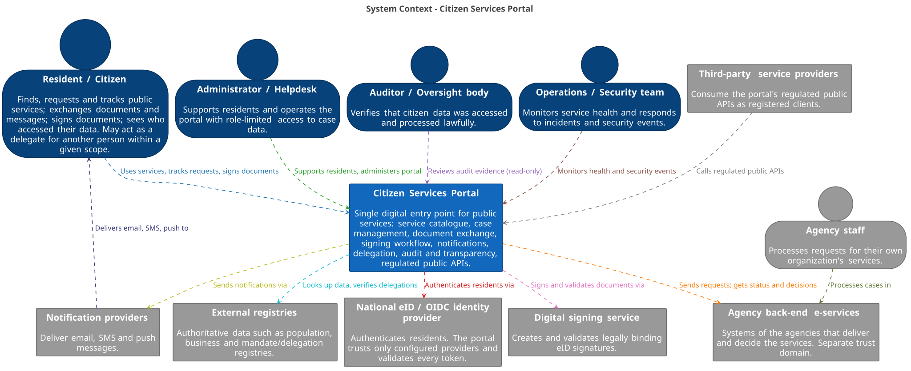

= Architecture Document
:toc:
:toclevels: 3

== 1. Executive summary

* What is the system?
* Who is it for?
* What are the top architectural drivers?

== 2. Architectural drivers

Link to or summarize link:drivers.adoc[drivers.adoc].

=== 2.1 Business goals

=== 2.2 Quality attributes

=== 2.3 Constraints and assumptions

== 3. System context

.System context of the Citizen Services Portal (source: link:../diagrams/workspace.dsl[workspace.dsl], Structurizr DSL)

Dashed boxes show trust domains. Each relationship that crosses a box edge is a
trust boundary, listed in link:security_goals.adoc[security_goals.adoc] (section 5.2).

The portal is the single entry point through which residents, and delegates acting within a
given scope, find, request, track and sign public services. Administrators and helpdesk staff
work in role-limited back-office functions. Auditors have read-only access to audit evidence.
Operations and security teams monitor the platform.

Inside the system boundary are the service catalogue, case management, document exchange (including
antivirus scanning and retention), the signing workflow, notification orchestration, the
authorization and delegation checks, audit and transparency, and the regulated public APIs.
Outside the system boundary are the systems the portal integrates with but does not control:

* *National eID/OIDC identity provider* - authenticates residents. The portal trusts only configured providers, validates every token, and makes all authorization decisions itself (SG-2, SG-4).
* *Digital signing service* - creates and validates legally binding eID signatures (SG-3).
* *Agency back-end e-services* - agency staff process cases here. The portal forwards requests and documents and receives status updates and decisions. Each agency is a separate trust domain and gets only the minimum data it needs (SG-5, QA-3).
* *External registries* - authoritative population, business and mandate/delegation data. If a delegation cannot be verified, delegated access is denied (SG-7, SG-9).
* *Third-party service providers* - call the regulated public APIs as authenticated, scoped and rate-limited clients (SG-10).
* *Notification providers* - deliver email, SMS and push messages, which carry only minimal content (QA-2).

== 4. Containers

Add the C4 container diagram and supporting text.

== 5. Components

Add at least two component views for important containers.

== 6. Key architectural mechanisms

=== Identity and access

=== Data management

=== Workflow and messaging

=== Auditing and logging

== 7. Interfaces

Link to API specifications in link:../api/[api/].

== 8. Security analysis

Link to threat model and risk register artifacts.

== 9. Deployment and operations

Link to deployment, observability, and recovery notes in link:../ops/[ops/].

== 10. Evolution plan

Describe expected changes, versioning, compatibility, migration, and deprecation.

== Appendix

* ADR index: link:../adrs/README.adoc[adrs/README.adoc]
* Glossary: TODO
