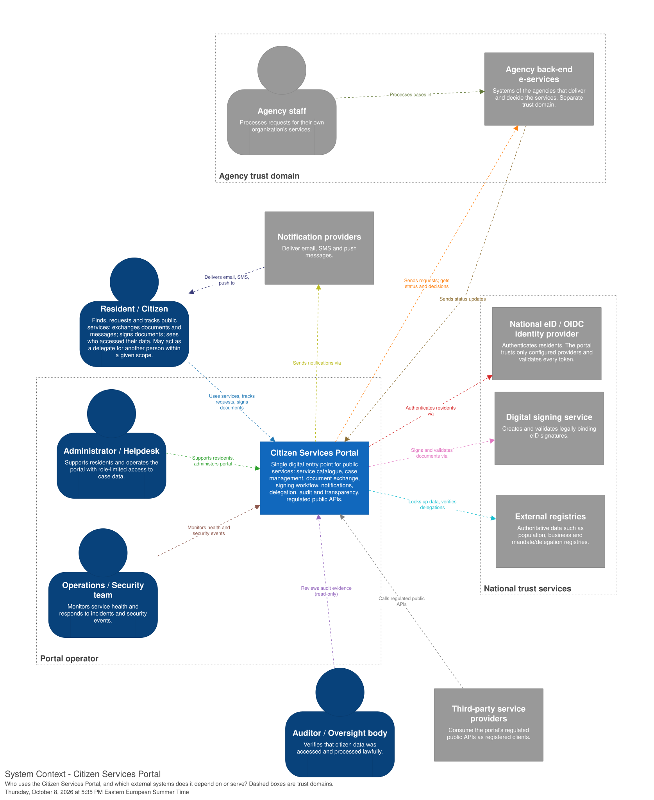
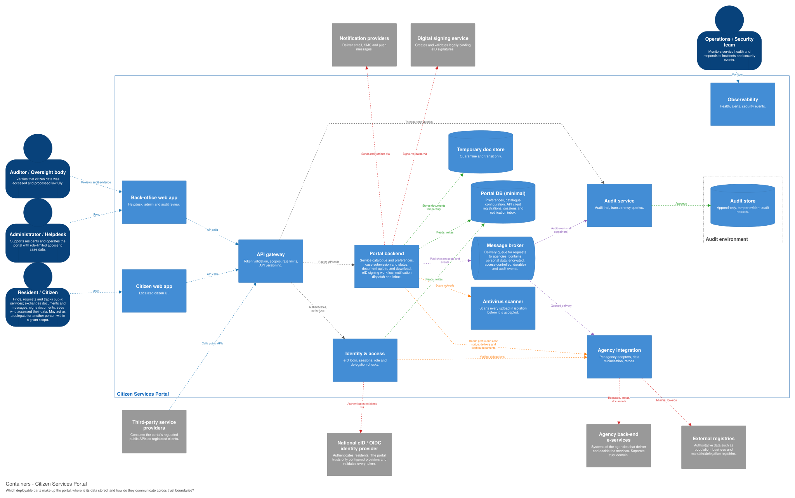

= Architecture Document
:toc:
:toclevels: 3

== 1. Executive summary

=== What the system is

The Citizen Services Portal is a single digital entry point through which residents find,
request, track, and manage public services. It authenticates residents through a national
eID/OIDC identity provider, hosts the service catalogue and case workflows, exchanges documents
and notifications, and integrates the back-end systems of the public agencies that actually
deliver the services.

The full problem statement is in link:scenario.adoc[scenario.adoc].

=== Who it is for

[cols="1,3",options="header"]
|===
|User group |What they do with the portal

|Residents/citizens |Discover and request public services, track cases, exchange documents and messages, sign documents, and see how their personal data has been used.
|Delegates |Act on behalf of another person within a given scope.
|Agency staff |Process requests that the portal forwards to their agency's own systems; they do not use the portal.
|Administrators and helpdesk |Support residents and operate the portal, with role-limited access to case data.
|Auditors and oversight bodies |Verify that citizen data has been accessed and processed lawfully.
|Service provider organizations |Offer their services through the portal, or consume regulated public APIs as third-party clients.
|Operations and security teams |Monitor service health and respond to security events.
|===

=== Top architectural drivers

Five drivers are architecture-critical and shape the structure of the system. They are defined
in full in link:quality_attributes.adoc[quality_attributes.adoc].

. *QA-1 Authorization and confidentiality* - protected data reaches only explicitly authorized actors.
. *QA-2 Privacy and data minimization* - only the personal data needed for a purpose is processed or disclosed.
. *QA-3 Availability and resilience* - one failing dependency must not take unrelated functionality down.
. *QA-4 Auditability and accountability* - security-relevant actions leave reliable, reviewable evidence.
. *QA-5 Evolvability and interoperability* - new agencies and services are added without reworking the core.

== 2. Architectural drivers

link:drivers.adoc[drivers.adoc],
link:quality_attributes.adoc[quality_attributes.adoc],
link:qa_scenarios.adoc[qa_scenarios.adoc],
link:security_goals.adoc[security_goals.adoc] and
link:../risk/risk_register.adoc[risk/risk_register.adoc].

=== 2.1 Business goals

* *BG-1* Single trustworthy digital entry point for discovering, requesting, tracking and managing public services.
* *BG-2* Citizen data processed lawfully, securely, and only for appropriate purposes.
* *BG-3* Residents and oversight bodies can understand and verify how data and requests were accessed and processed.
* *BG-4* New agencies and services join without major changes to the portal or to existing agency systems.
* *BG-5* Essential capabilities stay reachable despite component failures or external outages.
* *BG-6* Services are understandable and usable across languages, abilities, ages and levels of technical literacy.
* *BG-7* The portal evolves with services, regulations, integrations and technologies without major redesign.

Full text: Mission goals in link:drivers.adoc[drivers.adoc]. Quality attribute scenarios in
link:qa_scenarios.adoc[qa_scenarios.adoc] reference these goals by ID.

=== 2.2 Quality attributes

Thirteen quality attributes, constraints and security-relevant requirements are prioritized in
link:quality_attributes.adoc[quality_attributes.adoc]. The five architecture-critical ones:

* *QA-1 Authorization and confidentiality* - sensitive citizen data, cases, documents and messages are accessible only to explicitly authorized users or organizations.
* *QA-2 Privacy and data minimization* - only the personal data necessary for the service and purpose is processed or disclosed, including towards agencies.
* *QA-3 Availability and resilience* - failure of one external agency or supporting service does not make unrelated functionality unavailable; the system degrades safely and recovers.
* *QA-4 Auditability and accountability* - security-relevant access and actions produce reliable audit evidence for later review by authorized parties.
* *QA-5 Evolvability and interoperability* - new agencies and services are integrable without major changes to the core architecture or existing integrations.

The remaining eight (QA-6 to QA-13) cover trusted authentication, integrity, recoverability,
observability, performance, usability/accessibility, secure external integrations and regulatory
compliance. Three trade-offs are recorded in section 3 of
link:quality_attributes.adoc[quality_attributes.adoc]: auditability versus privacy, security and
privacy versus usability, and availability versus security controls.

=== 2.3 Constraints and assumptions

Constraints:

* *Regulatory compliance (QA-13)* - the architecture must support GDPR, national digital-identity, public-sector and retention requirements.
* *Trusted authentication (QA-6)* - citizen authentication must use an approved national eID or trusted OIDC-based identity provider, validated before a portal session is established.
* *No credential issuance* - the portal integrates with identity providers but does not issue or manage national identity credentials (see Out of scope in link:drivers.adoc[drivers.adoc]).

Assumptions that most shape the design:

* The target country is Estonia.
* A national eID or equivalent identity provider exists and is available to delegate authentication to.
* Back-end e-services expose APIs the portal can integrate with.
* Agencies are willing to adopt the integration contract and schema defined by the portal.

Full lists, including open questions, are in link:drivers.adoc[drivers.adoc].

== 3. System context

.System context of the Citizen Services Portal (source: link:../diagrams/workspace.dsl[workspace.dsl], Structurizr DSL)

Dashed boxes show trust domains. Each relationship that crosses a box edge is a
trust boundary, listed in link:security_goals.adoc[security_goals.adoc] (section 5.2).

The portal is the single entry point through which residents, and delegates acting within a
given scope, find, request, track and sign public services. Administrators and helpdesk staff
work in role-limited back-office functions. Auditors have read-only access to audit evidence.
Operations and security teams monitor the platform.

Inside the system boundary are the service catalogue, case management, document exchange (including
antivirus scanning and retention), the signing workflow, notification orchestration, the
authorization and delegation checks, audit and transparency, and the regulated public APIs.
Outside the system boundary are the systems the portal integrates with but does not control:

* *National eID/OIDC identity provider* - authenticates residents. The portal trusts only configured providers, validates every token, and makes all authorization decisions itself (SG-2, SG-4).
* *Digital signing service* - creates and validates legally binding eID signatures (SG-3).
* *Agency back-end e-services* - agency staff process cases here. The portal forwards requests and documents and receives status updates and decisions. Each agency is a separate trust domain and gets only the minimum data it needs (SG-5, QA-3).
* *External registries* - authoritative population, business and mandate/delegation data. If a delegation cannot be verified, delegated access is denied (SG-7, SG-9).
* *Third-party service providers* - call the regulated public APIs as authenticated, scoped and rate-limited clients (SG-10).
* *Notification providers* - deliver email, SMS and push messages, which carry only minimal content (QA-2).

== 4. Containers

.Containers of the Citizen Services Portal (source: link:../diagrams/workspace.dsl[workspace.dsl], Structurizr DSL)

All containers publish audit events to the message broker; these arrows are not drawn for readability, and the broker's arrow to the audit service stands for all of them.

[cols="1,3",options="header"]
|===
|Container |Responsibility

|Citizen web app, back-office web app
|Localized citizen UI. Helpdesk, administration and audit review UI with role-limited access.

|API gateway
|Single entry point for both web apps and third-party API clients: token validation, scopes, rate limiting and API versioning.

|Identity & access
|eID/OIDC login, sessions, and role and delegation-based authorization checks. Delegations are verified against the mandate registry.

|Portal backend
|One modular backend service with five modules: *catalogue and preferences* (service catalogue and resident preferences; profile data is read from registries on demand), *cases* (submits requests and shows live case status; stores no case content), *documents* (sends every upload to the antivirus scanner before it is accepted, then delivers it to the agency; downloads are fetched from the agency; the temporary document store holds files only until they are scanned and delivered), *signing workflow* (runs the eID signing flow with the external signing service) and *notifications* (in-app inbox and dispatch to email, SMS and push providers). These modules will be shown in a component view later.

|Antivirus scanner
|Scans every upload in isolation before it is accepted. The documents module of the Portal backend sends each upload here.

|Message broker
|Asynchronous delivery queue to agencies, plus the audit event stream. It holds queued requests, which contain personal data, until they are delivered to the agency, so it is encrypted, access-controlled and durable.

|Agency integration
|Adapters for each agency and registry, a canonical data model, data minimization, retries and mutual TLS.

|Audit service, audit store
|Collects audit events from all services into append-only, tamper-evident storage, and serves resident transparency and auditor queries. Append-only is enforced by insert-only database permissions and hash chaining (tamper evidence), not by the database itself.

|Portal DB (minimal)
|Preferences, catalogue configuration, API client registrations, sessions and the notification inbox.

|Observability
|Monitoring, logs and tracing for the operations and security team.
|===

Containers are separate only where there is a security or trust reason. Identity & access makes
every authentication and authorization decision (SG-2, SG-4). Agency integration crosses the agency
trust boundary and isolates each agency's adapter, so agencies can be added without touching the
rest of the portal (QA-5, R09). Audit is kept apart, and its store runs in a separate environment,
so that ordinary portal services cannot alter audit evidence (SG-6). The API gateway is the single
entry point for third-party clients (SG-10). The antivirus scanner is isolated because uploaded
files are untrusted input (SG-8). Everything else is one modular backend, to keep deployment and
operations simple.

=== Data ownership

The portal holds as little business data as possible. Case content, documents, profile data and
delegations stay with the owning agencies and registries, and the portal reads them live through
the agency integration service. The portal stores only its own data: preferences, catalogue
configuration, API client registrations, sessions, the notification inbox, documents in transit,
queued requests in the message broker (which contain personal data), and the audit trail.

The decision is recorded in link:../adrs/ADR-0002-portal-stores-minimal-data.adoc[ADR-0002].

Reading data live keeps the portal from becoming a second copy of agency data (R13), but it makes
the portal depend on agency availability and load (R15). When an agency is unavailable, the
portal must show that clearly rather than stale data. Asynchronous submission through the
message broker lets residents submit requests even while the agency is down. Container
ownership follows link:ownership_sketch.adoc[ownership_sketch.adoc].

=== Quality attribute scenarios

How the containers handle each scenario in link:qa_scenarios.adoc[qa_scenarios.adoc]:

* *Scenario 1* (delegation registry unavailable): Identity & access verifies each delegation against External registries through Agency integration; if the registry cannot be reached, it denies the delegated request, while the resident's own cases stay available.
* *Scenario 2* (helpdesk document access): the helpdesk worker opens the document in the Back-office web app; the Portal backend fetches it from the agency through Agency integration and publishes an audit event to the Message broker, which the Audit service writes to the Audit store.
* *Scenario 3* (another resident's document): the API gateway passes the request to Identity & access, which denies it; the denied attempt is published as an audit event through the Message broker to the Audit service and Audit store.
* *Scenario 4* (agency unavailable during submission): the Message broker queues requests while an agency is down; Agency integration delivers them after recovery.
* *Scenario 5* (new agency service): Agency integration gets one new adapter and the service is added as catalogue configuration in Portal DB (minimal); the Portal backend and existing adapters do not change.

== Open questions and known inconsistencies

* Container and actor names are not final.
* No overall availability target is defined yet ("what does available enough mean?", QA-3).
* Whether a digital fallback login is required for residents without eID (R14).
* Whether delegation decisions may be cached, and for how long (QA scenario 1).
* Agency staff document access is not visible in the portal's audit trail (link:../adrs/ADR-0002-portal-stores-minimal-data.adoc[ADR-0002], BG-3).
* Sections 5-10 are not started yet.

== 5. Components

Add at least two component views for important containers.

== 6. Key architectural mechanisms

=== Identity and access

=== Data management

=== Workflow and messaging

Workflow: a resident submits a service request (*Scenario 4*).

*Normal flow*

. Citizen web app sends the form with a new submission ID to the API gateway.
. API gateway checks the token; Identity & access checks the resident may submit.
. Portal backend saves the submission ID in Portal DB and publishes the request to the Message broker in one transaction.
. Portal backend confirms the submission; the resident sees "Request received".
. Message broker delivers the request to Agency integration, which sends it to the agency.
. The agency returns a case reference; Portal backend saves it with the submission ID in Portal DB.
. Portal backend notifies the resident with the case reference; all steps send audit events through the Message broker to the Audit service.

*Lost reply*

The request is saved, but the reply to the browser is lost.

* *Resident sees:* after 10 seconds, "Checking whether your request was received". The form is kept and _Submit_ is disabled.
* *Check:* the web app asks the Portal backend for the status of the same submission ID. If it exists, it shows "Request received" and the case reference, once the agency has given one.
* *Safe retry:* if not, the web app resends with the same submission ID. The Portal backend returns the existing case for a known ID, so no duplicate case or message is created.

*Test*

Drop the response for 100 submissions with a fault-injection proxy between the API gateway and the web app.
Expected: each submission ID has exactly one case and one queued message, a stub agency receives each request once and returns one case reference, and the resident sees that case reference.

=== Auditing and logging

== 7. Interfaces

Link to API specifications in link:../api/[api/].

== 8. Security analysis

Link to threat model and risk register artifacts.

== 9. Deployment and operations

Link to deployment, observability, and recovery notes in link:../ops/[ops/].

== 10. Evolution plan

Describe expected changes, versioning, compatibility, migration, and deprecation.

== Appendix

* ADR index: link:../adrs/README.adoc[adrs/README.adoc]
* Glossary: link:glossary.adoc[glossary.adoc]
